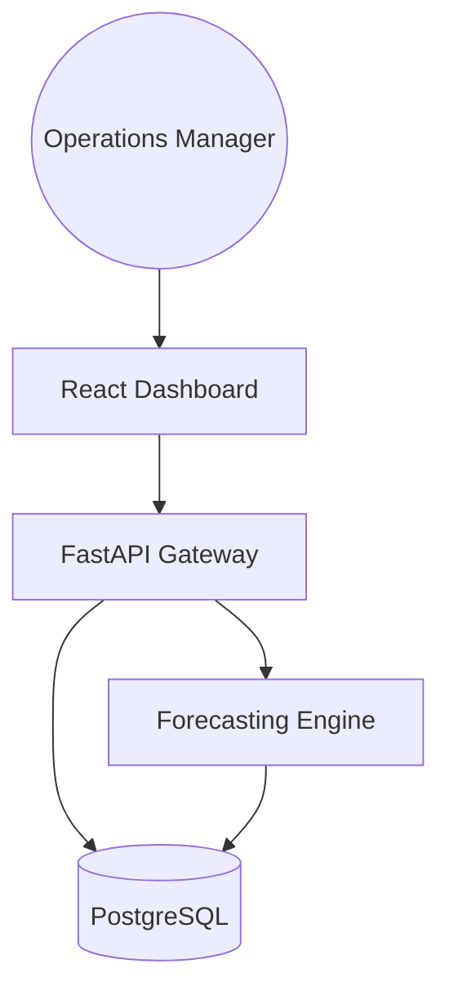
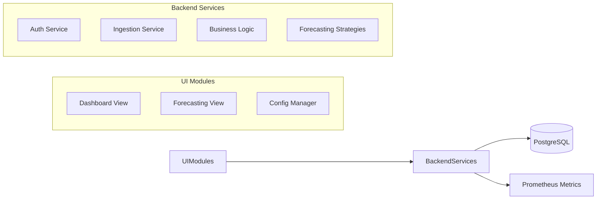
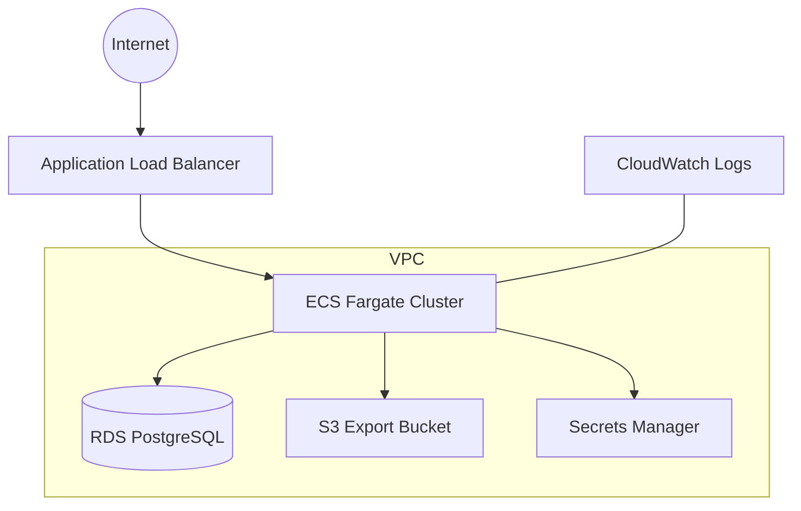

# Capacity Forecast Dashboard

<div align="center">
  
  <p><strong>Industrial-Grade Operations Capacity Planning & Forecasting Platform</strong></p>
</div>

---

## 🏛️ Executive Summary

The **Capacity Forecast Dashboard** is an enterprise-grade solution designed for Operations Managers to monitor historical consumption, predict future utilization, and manage infrastructure or service thresholds. By leveraging historical data and advanced forecasting algorithms (Moving Average, Trend Projection), the platform enables data-driven decision-making to prevent capacity-related outages and optimize resource allocation.

## 🚀 Key Features

- **Real-time Monitoring**: Interactive dashboards for capacity utilization.
- **Advanced Forecasting**: Pluggable engine supporting Moving Average and Linear Trend models.
- **Threshold Management**: Automated alerts when capacity exceeds predefined limits.
- **Multi-Tenant Ready**: Support for multiple teams, regions, and service categories.
- **Enterprise Security**: JWT-based authentication with RBAC and OIDC readiness.
- **Data Ingestion**: Support for CSV uploads, REST API ingestion, and automated mock data seeding.
- **Operational Reporting**: Exportable CSV and PDF reports for executive review.

## 🛠️ Tech Stack

| Layer | Technology |
|---|---|
| **Frontend** | React 18, TypeScript, Vite, Redux Toolkit, Tailwind CSS, Recharts |
| **Backend** | FastAPI (Python), Pydantic, SQLAlchemy |
| **Database** | PostgreSQL |
| **Infrastructure** | Terraform, AWS (VPC, ECS, RDS, S3, Secrets Manager) |
| **DevOps** | Docker, Docker Compose, GitHub Actions |
| **Observability** | OpenTelemetry, Prometheus, Structured Logging |

## 📐 Architecture Overview

### 1. Conceptual Architecture


### 2. Logical Architecture


### 3. Deployment Architecture (AWS)


## 🚦 Getting Started

### Local Development (Docker Compose)
1. Clone the repository.
2. Copy `.env.example` to `.env`.
3. Run `docker-compose up --build`.
4. Access the dashboard at `http://localhost:3000`.
5. API documentation available at `http://localhost:8000/docs`.

### Manual Setup (Backend)
```bash
cd backend
python -m venv venv
source venv/bin/activate
pip install -r requirements.txt
uvicorn app.main:app --reload
```

### Manual Setup (Frontend)
```bash
cd frontend
npm install
npm run dev
```

## 🧪 Testing
- **Backend**: `pytest`
- **Frontend**: `npm test`
- **E2E**: `npx playwright test`

## 🛡️ Security
- JWT-based authentication.
- Environment-based secret management.
- CORS/CSRF protections.
- Least-privilege IAM roles in production.

---
<sub>&copy; 2026 Devopstrio &mdash; Engineering the Future of Operations Intelligence.</sub>
