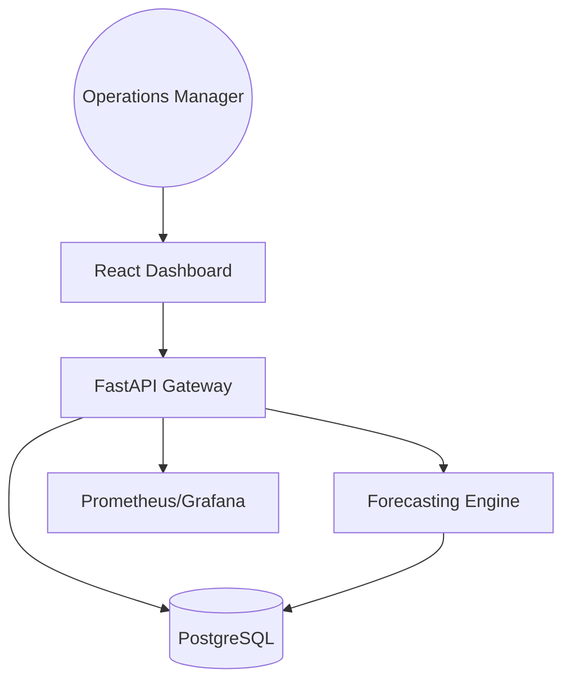
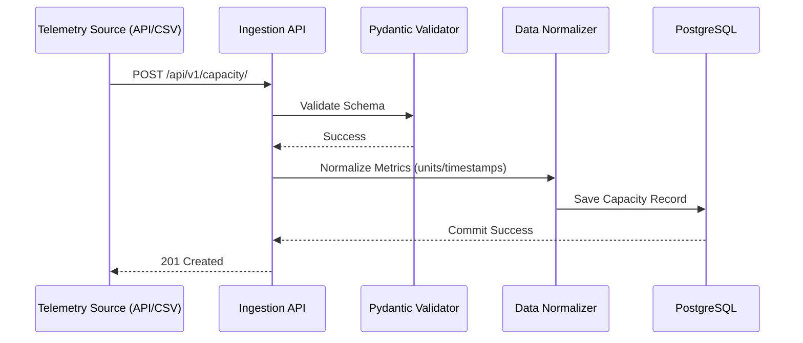
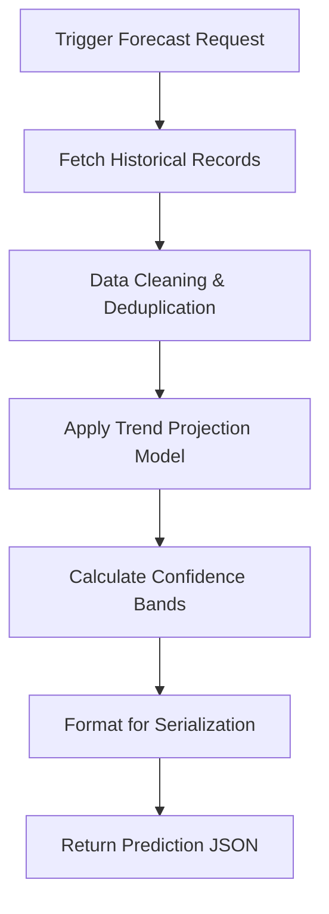
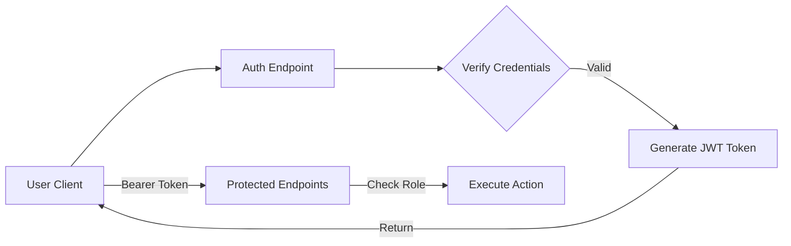
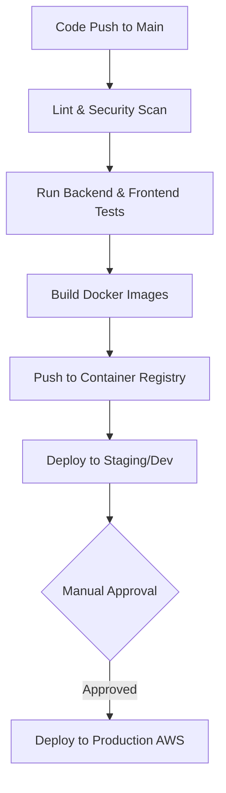
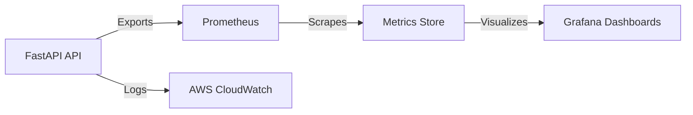

<div align="center">


<h1>Capacity Forecast Dashboard</h1>

<p><strong>Industrial-Grade Operations Capacity Planning & Forecasting Platform</strong></p>

[]()
[]()
[]()
[]()

<br/>

> **"Predict the future, optimize the present."** 
> The Capacity Forecast Dashboard is an institutional-grade operations engine designed to provide infrastructure teams with real-time visibility and predictive intelligence across global resource fleets.

</div>

---

## 🏛️ Executive Summary

The **Capacity Forecast Dashboard** is an enterprise-grade solution designed for Operations Managers to monitor historical consumption, predict future utilization, and manage infrastructure or service thresholds. By leveraging historical data and advanced forecasting algorithms (Moving Average, Trend Projection), the platform enables data-driven decision-making to prevent capacity-related outages and optimize resource allocation.

The solution is built on a high-performance stack comprising **FastAPI**, **React 18**, and **PostgreSQL**, with a dedicated **Forecasting Engine** capable of processing large-scale telemetry data to generate actionable growth projections.

---

## 🚀 Key Features

- **Real-time Monitoring**: High-fidelity interactive dashboards for capacity utilization tracking.
- **Advanced Forecasting Engine**: Pluggable architecture supporting Moving Average, Trend Projection, and future AI/ML models.
- **Dynamic Threshold Management**: Automated visual and programmatic alerts when capacity exceeds predefined safety limits.
- **Global Multi-Tenancy**: Granular isolation and filtering by business units, regions, and service categories.
- **Enterprise-Grade Security**: JWT-based authentication with Role-Based Access Control (RBAC) and OIDC readiness.
- **Automated Data Ingestion**: Robust pipelines for CSV uploads, REST API telemetry, and scheduled data synchronization.
- **Executive Reporting**: Boardroom-ready CSV and PDF reporting modules for operational audit and planning.

---

## 🛠️ Tech Stack

| Layer | Technology | Rationale |
|---|---|---|
| **Frontend** | React 18, TypeScript, Vite, Redux Toolkit, Tailwind CSS, Recharts | Component-based UI with predictable state management and high-performance visualizations. |
| **Backend** | FastAPI (Python), Pydantic, SQLAlchemy | Asynchronous, type-safe API gateway with rapid development capabilities. |
| **Database** | PostgreSQL | Relational storage for reliable metrics, forecasts, and user metadata. |
| **Forecasting** | NumPy, Pandas | Data science primitives for high-speed mathematical computations and trend analysis. |
| **Infrastructure**| Terraform, AWS (VPC, ECS, RDS, S3) | Declarative IaC for repeatable, secure, and scalable cloud deployments. |
| **DevOps** | Docker, Docker Compose, GitHub Actions | Containerized consistency and automated CI/CD lifecycle. |
| **Observability** | OpenTelemetry, Prometheus, JSON Logging | Comprehensive visibility into platform health and performance metrics. |

---

## 📐 Architecture & Workflow Deep-Dive

### 1. Conceptual Platform Architecture
This diagram illustrates the high-level relationship between end-users, the application interface, and the core processing engines.


*Caption: Users interact with the React Frontend, which communicates with the FastAPI Gateway to retrieve historical metrics and trigger forecasting computations.*

---

### 2. Detailed Data Ingestion Workflow
Understanding how external telemetry data reaches the platform is critical for maintaining data integrity.


*Caption: The ingestion pipeline ensures that all incoming metrics are validated against strict Pydantic schemas and normalized before persisting to the database.*

---

### 3. Forecasting Engine Execution Cycle
The forecasting engine follows a deterministic cycle to convert historical data points into future utilization curves.


*Caption: The engine performs on-the-fly trend analysis using NumPy, calculating both the point estimate and the confidence intervals (90%/110% bands).*

---

### 4. Authentication & RBAC Security Flow
Securing operations data is a primary requirement, handled via stateless JWT tokens and granular roles.


*Caption: All requests to protected resources must include a valid JWT. The API gateway validates the token and checks the user's role (Admin, Operator, Viewer) before processing.*

---

### 5. Multi-Environment CI/CD Lifecycle
The path from code commit to production deployment is fully automated through GitHub Actions.


*Caption: The CI/CD pipeline enforces code quality and security standards at every stage, requiring manual sign-off for production promotions.*

---

### 6. Observability & Monitoring Loop
Real-time monitoring ensures that the platform itself remains highly available and performant.


*Caption: Structured JSON logs and Prometheus metrics provide a comprehensive view of latency, error rates, and resource utilization.*

---

## 🚦 Getting Started

### Local Development (Docker Compose)
1. **Clone the repository**:
   ```bash
   git clone https://github.com/Devopstrio/capacity-forecast-dashboard.git
   cd capacity-forecast-dashboard
   ```
2. **Setup Environment**:
   ```bash
   cp .env.example .env
   ```
3. **Launch Platform**:
   ```bash
   docker-compose up --build
   ```
4. **Access Applications**:
   - **Dashboard**: `http://localhost:3000`
   - **Interactive API Docs**: `http://localhost:8000/docs`
   - **Prometheus Metrics**: `http://localhost:8000/metrics`

### Database Migration Guide
To update the schema, use Alembic from within the backend container:
```bash
docker exec -it capacity-backend alembic revision --autogenerate -m "new_change"
docker exec -it capacity-backend alembic upgrade head
```

---

## 🧪 Testing Strategy
The platform implements a multi-tier testing strategy to ensure reliability:
- **Backend**: Unit tests for the forecasting engine and API integration tests using `pytest`.
- **Frontend**: Component testing with `React Testing Library`.
- **E2E**: Critical path validation (Login -> Dashboard Load -> Export) via `Playwright`.

Run all tests:
```bash
# Backend
cd backend && pytest
# Frontend
cd frontend && npm test
```

---

## 🛡️ Security Posture
- **Encryption**: TLS enforced for all transit; sensitive data encrypted at rest in RDS.
- **Identity**: Standard JWT implementation with configurable expiry and secret rotation.
- **Networking**: VPC isolation with public/private subnet separation and restricted Security Groups.
- **Audit**: Every mutation recorded in audit logs with user attribution.

---

## 🤝 Support & Roadmap
- **Platform Inquiries**: platform@devopstrio.com
- **Enterprise Status**: [Status Page](https://status.devopstrio.com)

<div align="center">


**Engineering the future of operations intelligence — one forecast at a time.**

</div>
