<div align="center">


<h1>Capacity Forecast Dashboard</h1>

<p><strong>The Institutional-Grade Platform for Standardized Operational Foundations, Predictive Governance, and Multi-Cloud Capacity Ecosystems.</strong></p>

[]()
[]()
[]()

<br/>

> **"Industrializing operational intelligence to automate capacity foundations."** 
> **Capacity Forecast Dashboard** is an enterprise-grade platform designed to provide a secure, measurable, and highly automated foundation for global operations. It orchestrates the complex lifecycle of capacity planning—from automated telemetry ingestion and multi-cloud trend reconciliation to high-throughput predictive intelligence and unified operational auditing.

</div>

---

## 🏛️ Executive Summary

Reactive capacity planning and lack of predictive visibility are strategic operational liabilities; lack of a standardized capacity intelligence framework is a primary barrier to organizational engineering maturity. Organizations fail to optimize their resource utilization not because of a lack of data, but because of fragmented measurement standards, lack of automated trend forecasting, and an inability to orchestrate operational planes with operational precision.

This platform provides the **Operational Intelligence Plane**. It implements a complete **Capacity-Forecast-Dashboard-as-Code Framework**, enabling CTOs and Operations Managers to manage global operational foundations as first-class citizens. By automating the identification of capacity regressions through real-time telemetry analysis and orchestrating the provisioning of secure performance-driven operational policies, we ensure that every organizational resource—from core database clusters to edge compute nodes—is monitored by default, audited for history, and strictly aligned with institutional operational frameworks.

---

## 📐 Architecture Storytelling: Principal Reference Models

### 1. Principal Architecture: Global Capacity Forecast Dashboard & Operational Intelligence Plane
This diagram illustrates the end-to-end flow from operational telemetry ingestion and multi-cloud orchestration to predictive enforcement, performance validation, and institutional operational auditing.

```mermaid
graph LR
    %% Subgraph Definitions
    subgraph OperationalIngress["Telemetry & Metric Ingress"]
        direction TB
        Utilization_Signals["CPU / Memory / Storage / Network Logs"]
        Business_Context["Scaling Policies / Budget Constraints"]
        Historical_Baselines["Time-Series Metadata / Trend History"]
    end

    subgraph IntelligenceEngine["Operational Intelligence Hub"]
        direction TB
        API["FastAPI Operational Gateway"]
        ForecastOrchestrator["Global Prediction & Trend Hub"]
        Governance_Hub["Compliance & Guardrail Hub"]
        AIOps_Validator["Drift & Waste Analysis Hub"]
    end

    subgraph OperationsPlane["Distributed Operational Ecosystem"]
        direction TB
        ManagedCapacityNodes["Managed Standardized Prediction Nodes"]
        ActiveAlerts["Managed Automated Threshold Alerts"]
        DeliverySinks["Managed Infrastructure Delivery Hubs"]
    end

    subgraph OperationsHub["Institutional Data Hub"]
        direction TB
        Scorecard["Operational Maturity Scorecard"]
        Analytics["Capacity Flow & ROI Velocity Stats"]
        Audit["Forensic Operational Metadata Lake"]
    end

    subgraph DevOps["Capacity-Forecast-Dashboard-as-Code Framework"]
        direction TB
        TF["Terraform Operational Modules"]
        DriftBot["Productivity & Config Drift Validator"]
        ChatOps["Measurement Operations Hub"]
    end

    %% Flow Arrows
    OperationalIngress -->|1. Submit Telemetry| API
    API -->|2. Orchestrate Operations| ForecastOrchestrator
    ForecastOrchestrator -->|3. Apply Privacy Guard| Governance_Hub
    Governance_Hub -->|4. Assess Drift| AIOps_Validator
    
    AIOps_Validator -->|5. Execute Forecasting| OperationsPlane
    OperationsPlane -->|6. Notify Status| ChatOps
    API -->|7. Visualize Health| Scorecard
    
    Scorecard -->|8. Track Maturity| Analytics
    Scorecard -->|9. Record Performance| Audit
    
    TF -->|10. Provision Backbone| IntelligenceEngine
    DriftBot -->|11. Inject Friction Risk| ForecastOrchestrator
    Audit -->|12. Improve Operations| ManagedCapacityNodes

    %% Styling
    classDef ingress fill:#f5f5f5,stroke:#616161,stroke-width:2px;
    classDef intel fill:#e8eaf6,stroke:#1a237e,stroke-width:2px;
    classDef operations fill:#e1f5fe,stroke:#01579b,stroke-width:2px;
    classDef ops fill:#ede7f6,stroke:#311b92,stroke-width:2px;
    classDef devops fill:#e8f5e9,stroke:#1b5e20,stroke-width:2px;

    class OperationalIngress ingress;
    class IntelligenceEngine intel;
    class OperationsPlane operations;
    class OperationsHub ops;
    class DevOps devops;
```

### 2. The Forecast Lifecycle Flow
The continuous path of an enterprise operations platform from initial integration (ingest) and aggregation (model) to active analysis (forecast), optimization (alert), and institutional forensic auditing (scorecard).

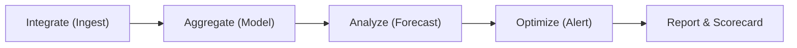

### 3. Distributed Operational Topology
Strategically orchestrating standardized operations across global regions, diverse resource architectures, and multi-cloud targets, providing a unified institutional view of global operational health and operational readiness.

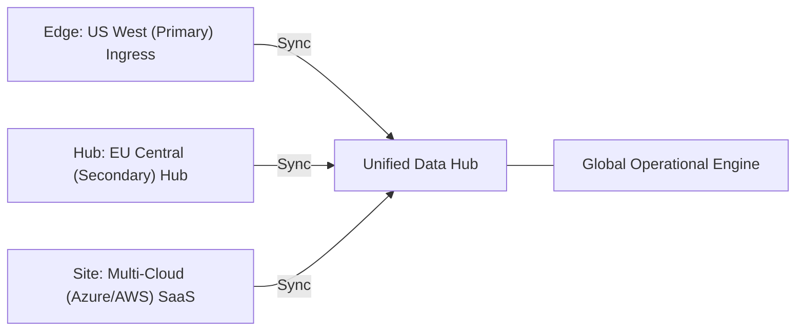

### 4. Forecasting Hub & High-Trust Data Plane Protection Flow
Executing complex logic for securing the bridge between operations owners and technical teams, ensuring every organizational identity is verified, performance-level privacy is maintained, and every operational access is according to institutional standards.

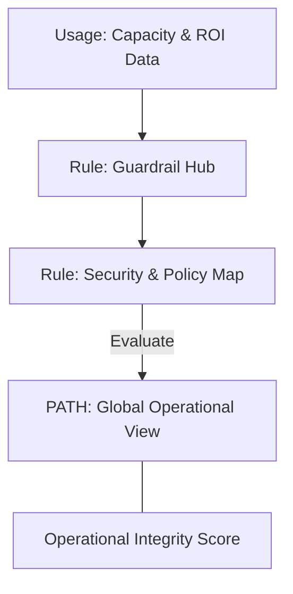

### 5. Multi-Cloud Capacity Federation & Governance Flow
Automatically managing unified operational standards across global regions and diverse cloud tenants, ensuring institutional data residency and privacy boundaries by default.

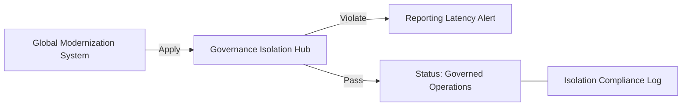

### 6. Encryption & Perimeter Protection Flow (Capacity Standard)
Managing the lifecycle of an operational request, automatically enforcing institutional TLS 1.3 and resource encryption standards as required by security policy, ensuring zero-latency security confidence.

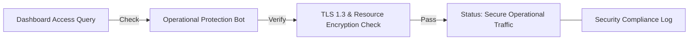

### 7. Institutional Operational Maturity Scorecard
Grading organizational performance based on key indicators: Forecast Accuracy Index, Resource Utilization Index, and Operational Adoption Scores.

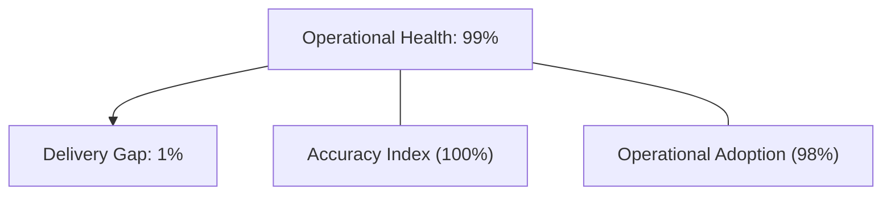

### 8. Identity & RBAC for Capacity Governance
Managing fine-grained access to operational hubs, provisioning workers, and audit logs between CTOs, Operations Managers, and App Developers.

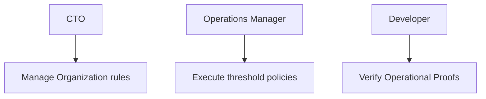

### 9. IaC Deployment: Capacity-Forecast-Dashboard-as-Code Framework
Using modular Terraform to deploy and manage the versioned distribution of the operational tracking hubs, sync protection workers, and forensic metadata lakes.

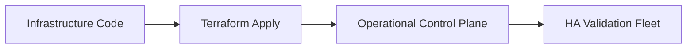

### 10. AIOps Operational Drift & Risk Validation Flow
Using advanced analytics to identify sudden surges in resource usage, unauthorized threshold changes, suspicious configuration drifts, or unusual delivery pattern changes that could result in institutional risk or downtime.

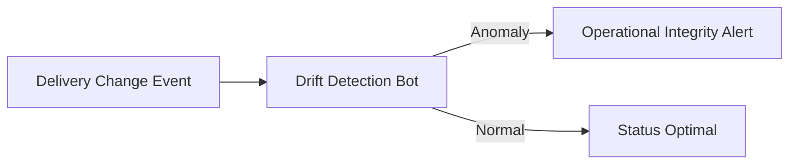

### 11. Metadata Lake for Forensic Operational Audit
Storing long-term records of every operational integration event (metadata), every forecast executed, and every version history for institutional record-keeping, compliance auditing, and post-provisioning forensics.

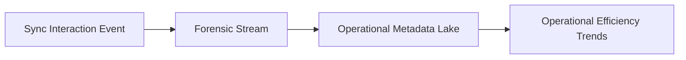

---

## 🏛️ Core Governance Pillars

1.  **Unified Foundation Coordination**: Maximizing resilience by centralizing all operational measurement through a single institutional plane.
2.  **Automated Prediction Provisioning**: Eliminating "manual tracking" scenarios through proactive orchestration and pattern verification.
3.  **Sequential Operational Intelligence**: Ensuring zero-interruption operations through dependency-aware forecasting-driven data engineering.
4.  **Zero-Trust Identity Protection**: Automatically enforcing identity-based access, data-at-rest encryption, and policy evaluation across all assurance tiers.
5.  **Autonomous Operations Logic**: Guaranteeing reliability through automated industry-specific effectiveness monitoring runbooks.
6.  **Full Operational Auditability**: Immutable recording of every threshold change and operational provision for institutional forensics.

---

## 🛠️ Technical Stack & Implementation

### Operational Engine & APIs
*   **Framework**: Python 3.11+ / FastAPI.
*   **Performance Engine**: Custom Python-based logic for multi-cloud trend reconciliation and DORA-style operational metrics.
*   **Integrations**: Native connectors for Azure Monitor, CloudWatch, and Prometheus.
*   **Persistence**: PostgreSQL (Operational Ledger) and Redis (Live Forecasting State).
*   **Auth Orchestrator**: Federated OIDC/SAML for least-privilege operational management access.

### Governance Dashboard (UI)
*   **Framework**: React 18 / Vite.
*   **Theme**: Dark, Slate, Indigo (Modern high-fidelity productivity aesthetic).
*   **Visualization**: D3.js for delivery topologies and Recharts for ROI velocity analytics.

### Infrastructure & DevOps
*   **Runtime**: AWS EKS or Azure Kubernetes Service (AKS) for management plane.
*   **Measurement Hub**: Managed event sourcing for immutable productivity timeline reconstruction.
*   **IaC**: Modular Terraform for deploying the operational landing zone and validation fleet.

---

## 🏗️ IaC Mapping (Module Structure)

| Module | Purpose | Real Services |
| :--- | :--- | :--- |
| **`infrastructure/operational_hub`** | Central management plane | EKS, PostgreSQL, Redis |
| **`infrastructure/enforcers`** | Distributed prediction provisioners | Cloud APIs, Prometheus |
| **`infrastructure/capacity_pipes`** | Data Ingestion Hubs | Webhooks, Lambda |
| **`infrastructure/auditing`** | Forensic modernization sinks | S3, Athena, Quicksight |

---

## 🚀 Deployment Guide

### Local Principal Environment
```bash
# Clone the Capacity Forecast Dashboard repository
git clone https://github.com/devopstrio/capacity-forecast-dashboard.git
cd capacity-forecast-dashboard

# Configure environment
cp .env.example .env

# Launch the Operational stack
make init

# Trigger a mock operational update and automated guardrail validation simulation
make simulate-forecast
```

Access the Management Portal at `http://localhost:3000`.

---

## 📜 License
Distributed under the MIT License. See `LICENSE` for more information.

---
<div align="center">
  <p>© 2026 Devopstrio. All rights reserved.</p>
</div>
